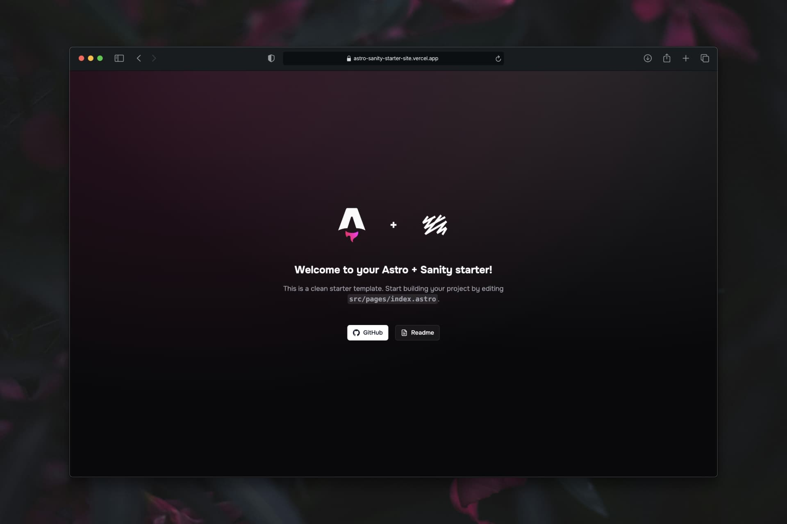

<div align="center">
  <a href="https://astro-sanity-starter-site.vercel.app">
    
  </a>
  <p></p>
</div>

<div align="center">

# Astro + Sanity Starter


</div>

A statically-rendered, CMS-driven site starter: **Astro 6** frontend + a **Sanity** Studio for content. Built with a typed view-adapter data layer connecting Sanity directly to Astro components. Ships a clean welcome page and a **Sanity schema skeleton** to build your pages on top.

## Tech Stack & Features

- **Astro 6**, static output, Vercel adapter, TypeScript strict, Tailwind v4 (via `@tailwindcss/vite`), Onest font.
- **Sanity Studio** in [`/studio`](./studio) — its own pnpm workspace (separate deps + lockfile) so the static site stays lean. Singletons (Home, Site Settings), orderable collections, reusable objects — all a generic skeleton to fill in.
- **View-adapter data layer**: GROQ + raw types in [`src/lib/sanity.ts`](./src/lib/sanity.ts) → mapped "View" shapes in [`src/lib/content.ts`](./src/lib/content.ts) → components. **Components never touch Sanity** — swap the data source without touching the UI.
- Editor-managed **structured data** (schema.org JSON-LD) built in [`src/lib/structured-data.ts`](./src/lib/structured-data.ts) from `siteSettings`.
- Smooth scroll (Lenis), view transitions, and scroll-reveal animations (GSAP) as scaffolding.

## Quickstart

```bash
pnpm install                 # frontend deps
pnpm --dir studio install    # studio deps (separate workspace)

# Make sure you have the .env.local with Sanity variables
cp .env.example .env.local   # fill PUBLIC_SANITY_STUDIO_PROJECT_ID

pnpm dev                     # site → http://localhost:4321
pnpm dev:studio              # studio → http://localhost:3333
```

## Content Management

To edit the content of the pages, use the Sanity Studio:

1. Run the studio locally with `pnpm dev:studio`.
2. Edit documents, update images, and publish changes.
3. The frontend will fetch the latest content at build time (or you can view it live in dev mode).

> Note: Make sure `PUBLIC_SANITY_STUDIO_PROJECT_ID` and `PUBLIC_SANITY_STUDIO_DATASET` are set in your `.env.local`.

## Scripts

| Script | What |
|--------|------|
| `pnpm dev` / `build` / `preview` | Astro frontend |
| `pnpm lint` / `lint:fix` / `format` | ESLint + Prettier |
| `pnpm dev:studio` / `build:studio` / `deploy:studio` | Sanity Studio |

## Docs

1. [00 — Overview](./docs/00-overview.md)
2. [01 — Setup](./docs/01-setup.md)
3. [02 — Architecture](./docs/02-architecture.md)
4. [03 — Add a resource](./docs/03-add-resource.md)
5. [04 — Sanity Studio](./docs/04-sanity-studio.md)
6. [05 — Deploy](./docs/05-deploy.md)
7. [06 — Sanity Webhook](./docs/06-sanity-webhook.md)
8. [07 — Internationalization](./docs/07-i18n.md)

Conventions for AI coding agents: [CLAUDE.md](./CLAUDE.md).

## License

MIT
